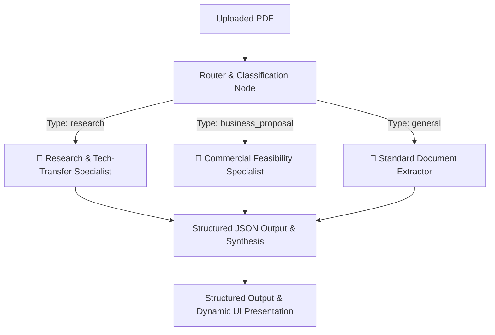

# Enterprise Document Intelligence & Extraction Pipeline

An asynchronous, production-ready microservice built with **FastAPI**, **LangGraph**, and **Docker** that classifies, routes, and extracts structured intelligence from documents using **Google Gemini 2.5 Flash**.

---

## Live Demo & API Docs

The application is deployed on **[FastAPI Cloud](https://fastapicloud.com/)**:
* **[LIVE WEB UI & DEMO](https://enterprise-pdf-extractor.fastapicloud.dev/)**
* **[LIVE SWAGGER UI DOCS](https://enterprise-pdf-extractor.fastapicloud.dev/docs)**

*(Protected with an in-memory rate limiter allowing 5 requests per minute per IP.)*

---

## Architecture (LangGraph StateGraph)

Rather than treating every document with a generic single-pass prompt, this system uses an **Intelligent Routing & Domain Specialist** pattern:



### Specialized Agents

1. **Router & Classifier Agent:**
   * Analyzes document structure and excerpts to determine the category (`research`, `business_proposal`, or `general`) with a statistical confidence score and explicit reasoning.
2. **🔬 Research & Innovation Specialist (Tech-Transfer & TRL Focus):**
   * Designed specifically for academic papers, patent disclosures, and scientific breakthroughs.
   * **TRL Evaluation:** Automatically assesses the **Technology Readiness Level (1–9)** with concrete justification from experimental evidence.
   * **Commercial Potential:** Identifies practical industrial use cases and target markets.
   * **Development Gaps:** Highlights missing laboratory validations or hurdles prior to commercialization.
3. **💼 Business Proposal & Feasibility Specialist:**
   * Extracts budgets, funding requested, and projected ROI figures.
   * Computes an objective **Feasibility Score (1–10)** and generates a structured **Risk Matrix** (Financial, Execution, Market Adoption).
   * Provides an executive strategic recommendation (*Approved for Tech-Transfer Screening*, *Revision Required*, etc.).
4. **📄 General Enterprise Specialist (Fallback):**
   * Robust entity recognition (organizations, technologies, dates) and key numerical data extraction.
5. **Executive Synthesis Node:**
   * Consolidates all specialist findings into a comprehensive executive brief and actionable next steps, localized into any target language (defaulting to Hungarian).

---

## Tech Stack

- **Agent Orchestration:** [LangGraph](https://github.com/langchain-ai/langgraph) (StateGraph, TypedDict State, Conditional Routing)
- **AI Model & Structured Output:** Google GenAI SDK / LangChain (`gemini-2.5-flash` with strict Pydantic schemas)
- **Backend Framework:** FastAPI (Python 3.11, asynchronous execution)
- **Frontend UI:** Vanilla HTML5, CSS3 (minimalist dark UI, agent timeline, responsive badges), JavaScript (Fetch API, drag-and-drop, one-click JSON export)
- **Security & Rate Limiting:** slowapi (in-memory rate limiting)
- **Containerization:** Docker (`python:3.11-slim`)
- **Deployment:** [FastAPI Cloud](https://fastapicloud.com/) (zero-config, scale-to-zero)
- **Testing:** Pytest & HTTPX (100% automated test coverage with mocked LLM agents)

---

## API Usage Example

To dispatch the multi-agent pipeline on a document and synthesize the executive brief in Hungarian:

```http
POST /api/v1/extract?target_language=Hungarian HTTP/1.1
Content-Type: multipart/form-data

file: [research_paper_or_business_plan.pdf]
```

### Sample Response Excerpt:
```json
{
  "dispatched_agent": "🔬 Research & Innovation Specialist (TRL & Tech-Transfer)",
  "classification": {
    "doc_type": "research",
    "confidence": 0.96,
    "rationale": "Academic methodology and experimental lab prototype validation identified."
  },
  "research_analysis": {
    "trl_level": 4,
    "trl_justification": "Small-scale laboratory prototype demonstrated 24.2% photon conversion efficiency.",
    "scientific_novelty": "Novel double-cation passivation layer.",
    "commercial_use_cases": [
      "Building-integrated photovoltaics (BIPV)",
      "Aerospace solar arrays"
    ],
    "development_gaps": [
      "Long-term thermal stability test under 85°C required"
    ]
  },
  "translation_pipeline": {
    "summary": "Úttörő perovskite napelem kutatás...",
    "action_items": [
      "Szabadalmi bejelentés előkészítése a technológiatranszfer irodával"
    ]
  }
}
```

---

## Local Development Setup

### 1. Clone & Setup Environment
```bash
git clone https://github.com/hunorarato72/enterprise-pdf-extractor.git
cd enterprise-pdf-extractor
```

Create a `.env` file in the root directory:
```env
GOOGLE_API_KEY="your_actual_gemini_api_key_here"
```

### 2. Install Dependencies & Run
```bash
python -m venv .venv

# On Windows:
.\.venv\Scripts\activate
# On Linux/macOS:
source .venv/bin/activate

pip install -r requirements.txt
uvicorn app.main:app --reload
```

* **Interactive Web UI:** http://127.0.0.1:8000/
* **Swagger API Documentation:** http://127.0.0.1:8000/docs

### 3. Run Automated Tests
```bash
pip install -r requirements-dev.txt
python -m pytest
```

---

## Deployment

### FastAPI Cloud (Production)

```bash
pip install "fastapi[standard]"
fastapi deploy
```

Set your environment variables via the CLI:
```bash
fastapi cloud env set --secret GOOGLE_API_KEY "your_key_here"
```

### Docker (Local / Alternative)

```bash
docker build -t multi-agent-extractor .
docker run -p 8000:8000 -e GOOGLE_API_KEY="your_key_here" multi-agent-extractor
```
